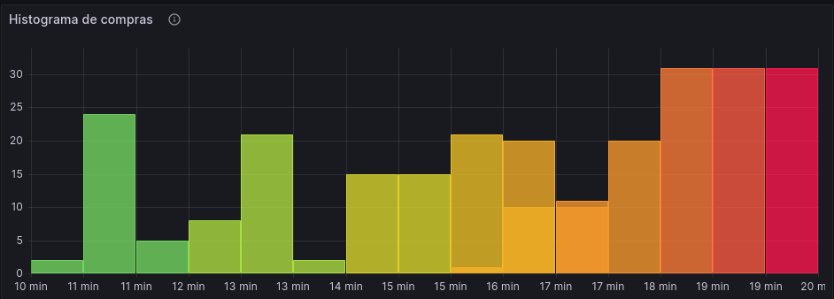
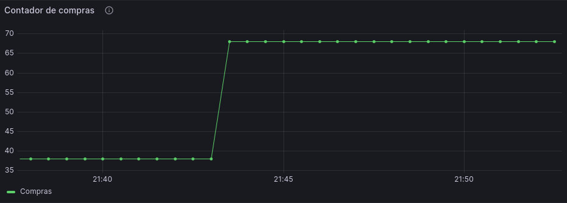
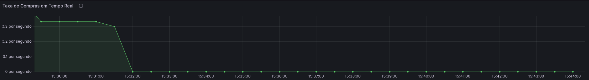

# [Apresentação Observabilidade de Negócio](https://docs.google.com/presentation/d/1YMQML8Ydc06uwHRLouDuDXnjS6Z6mzK4/edit#slide=id.p1)

ShopMetrics360 é uma aplicação de observabilidade de negócios que fornece insights valiosos sobre o comportamento de compra dos clientes em uma plataforma de comércio eletrônico. Utilizando a biblioteca `prom-client` para coletar e registrar métricas, o ShopMetrics360 permite que as empresas monitorem e analisem o desempenho de suas operações de vendas em tempo real.

## Sumário

- [Apresentação Observabilidade de Negócio](#apresentação-observabilidade-de-negócio)
- [Tecnologias Utilizadas](#tecnologias-utilizadas)
- [Case de Negócios para Observabilidade](#case-de-negócios-para-observabilidade)
- [Métricas Específicas e Seus Painéis](#métricas-específicas-e-seus-painéis)
- [Pré-requisitos](#pré-requisitos)
- [Instalação](#instalação)
- [Uso](#uso)
- [Docker](#docker)
- [Deploy](#deploy)

## Tecnologias Utilizadas

Este projeto foi construído com as seguintes tecnologias:

- [Node.js](https://nodejs.org/)
- [Express](https://expressjs.com/)
- [Prom-client](https://github.com/siimon/prom-client)
- [Docker](https://www.docker.com/)
- [Helm](https://helm.sh/)
- [K3d](https://k3d.io/)

## Case de Negócios para Observabilidade

A observabilidade é fundamental para entender o desempenho e a saúde de uma aplicação. Ela permite que as equipes de desenvolvimento identifiquem e resolvam problemas rapidamente, melhorando a confiabilidade e a experiência do usuário. Além disso, a observabilidade pode fornecer insights valiosos sobre o comportamento do usuário, ajudando a informar decisões de negócios e estratégias de produto.

Imagine que você é o proprietário de uma loja online que vende uma variedade de produtos. Você recentemente implementou algumas mudanças no design do seu site e quer entender como essas mudanças estão afetando a experiência de compra dos seus clientes. Para isso, você decide monitorar os tempos de compra dos seus clientes usando o Prometheus e visualizá-los em um histograma no Grafana.

Depois de coletar dados por uma semana, você começa a analisar os resultados. Primeiro, você olha para o percentil 50 (ou mediana) dos tempos de compra. Você vê que a mediana é de 10 minutos, o que significa que metade dos seus clientes está completando suas compras em 10 minutos ou menos. Isso parece razoável, mas você quer entender melhor a distribuição dos tempos de compra.

Em seguida, você olha para o percentil 90. Você vê que o percentil 90 é de 20 minutos, o que significa que 90% dos seus clientes estão completando suas compras em 20 minutos ou menos. Isso sugere que a maioria dos seus clientes está tendo uma experiência de compra bastante eficiente, mas há uma pequena porcentagem que está levando muito mais tempo.

Finalmente, você olha para o percentil 99. Você vê que o percentil 99 é de 40 minutos, o que significa que quase todos os seus clientes (99%) estão completando suas compras em 40 minutos ou menos. No entanto, isso também sugere que 1% dos seus clientes estão levando mais de 40 minutos para completar suas compras, o que é significativamente mais longo do que a maioria dos seus clientes. Isso pode indicar um problema que está afetando uma pequena porcentagem dos seus clientes, como um bug ou uma má experiência do usuário. Com essas informações, você pode investigar mais a fundo e tomar medidas para melhorar a experiência de compra para todos os seus clientes.


### Métricas Específicas e Seus Painéis

1. Histograma de Tempos de Compra (purchase_time)

Este histograma mostra a distribuição dos tempos de compra. Ele pode ajudar a identificar tendências e outliers, como tempos de compra excepcionalmente longos ou curtos. Isso pode ser útil para entender a eficiência do processo de compra e identificar áreas para melhoria.

**Painel:** Um gráfico de histograma mostrando a contagem de compras em cada intervalo de tempo. Este gráfico pode ser atualizado em tempo real à medida que novos dados são coletados.



**Necessidade:** Este painel fornece uma visão rápida e visual da distribuição dos tempos de compra. Ele pode ajudar a identificar tendências e outliers, informando decisões sobre onde focar os esforços de otimização.

2. Contador Total de Compras (total_purchases)

Este contador rastreia o número total de compras feitas. Ele pode ser usado para monitorar a atividade de compra ao longo do tempo e identificar tendências, como aumentos ou diminuições na atividade de compra.

**Painel 1:** Um contador simples mostrando o número total de compras. Este contador pode ser atualizado em tempo real à medida que novas compras são feitas.



**Necessidade:** Este painel fornece uma visão rápida e fácil de entender do volume total de compras. Ele pode ajudar a identificar tendências e padrões na atividade de compra, informando decisões sobre marketing e vendas.

**Painel 2:** O gráfico exibe a taxa de compras em unidades de "compras por segundo". A barra vertical representa a taxa de compras, onde a altura da barra indica a quantidade de compras ocorridas durante um determinado intervalo de tempo. Por exemplo, se a barra estiver em 1, isso indica uma taxa de 1 compra por segundo. Se a barra estiver em 0.3, isso significa que está ocorrendo uma compra a cada 3 segundos, em média.



**Necessidade:** Este painel fornece uma visão em tempo real da taxa de compras, mostrando a quantidade de compras ocorrendo em um determinado intervalo de tempo. Ele é útil para acompanhar o volume de compras e identificar qualquer variação ou tendência ao longo do tempo, auxiliando na tomada de decisões relacionadas a marketing e vendas.

### Pré-requisitos

Você precisará do Node.js e npm instalados em sua máquina para rodar este projeto. Você pode baixá-los [aqui](https://nodejs.org/).

### Instalação

Primeiro, clone este repositório para sua máquina local usando `git clone`.

Depois de clonar o repositório, instale as dependências do projeto com:

```bash
npm install
```

### Uso

Para iniciar o servidor, use o seguinte comando:

```bash
tsc src/server.ts && node src/server.js
```

O servidor estará rodando na porta 3000. Para atualizar o histograma, você pode enviar uma requisição GET para `http://localhost:3000/`. Para visualizar as métricas do Prometheus, você pode enviar uma requisição GET para `http://localhost:3000/metrics`.

### Docker

Este projeto também inclui um `Dockerfile` para rodar o aplicativo em um contêiner Docker. Você pode construir a imagem do Docker com:

```bash
docker build -t shopmetrics360 .
```

E pode rodar o contêiner com:

```bash
docker run -p 3000:3000 -d shopmetrics360
```

### Deploy

#### Criação do Cluster

```bash
k3d cluster create shopmetrics360
```

#### Deploy do Prometheus e Grafana

```bash
# Adicionando repositório ao Helm
helm repo add prometheus-community https://prometheus-community.github.io/helm-charts

# Deploy do Dashboard
kubectl apply -f Dashboards/shopmetrics360-dashboard.yaml

# Deploy da stack Prometheus e Grafana
helm install prometheus prometheus-community/kube-prometheus-stack --version 45.28.1 -f ./Helm/prometheus-grafana.yaml
```

#### Deploy da Aplicação

```bash
helm install shopmetrics360 -f ./Helm/ShopMetrics360/values.yaml ./Helm/ShopMetrics360
```
