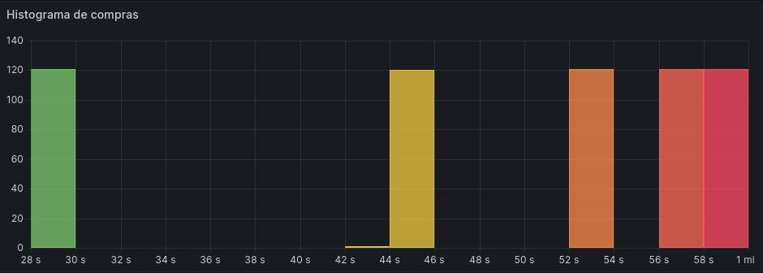

# Projeto Histograma

Este projeto é um exemplo simples de como criar e visualizar um histograma usando o pacote Node.js `prom-client` para coletar métricas de eventos de compra simulados.

## Case de Negócios para Observabilidade

A observabilidade é fundamental para entender o desempenho e a saúde de uma aplicação. Ela permite que as equipes de desenvolvimento identifiquem e resolvam problemas rapidamente, melhorando a confiabilidade e a experiência do usuário. Além disso, a observabilidade pode fornecer insights valiosos sobre o comportamento do usuário, ajudando a informar decisões de negócios e estratégias de produto.

### Métricas Específicas e Seus Painéis

1. Histograma de Tempos de Compra (purchase_time)

Este histograma mostra a distribuição dos tempos de compra. Ele pode ajudar a identificar tendências e outliers, como tempos de compra excepcionalmente longos ou curtos. Isso pode ser útil para entender a eficiência do processo de compra e identificar áreas para melhoria.

**Painel:** Um gráfico de histograma mostrando a contagem de compras em cada intervalo de tempo. Este gráfico pode ser atualizado em tempo real à medida que novos dados são coletados.



**Necessidade:** Este painel fornece uma visão rápida e visual da distribuição dos tempos de compra. Ele pode ajudar a identificar tendências e outliers, informando decisões sobre onde focar os esforços de otimização.

2. Contador Total de Compras (total_purchases)

Este contador rastreia o número total de compras feitas. Ele pode ser usado para monitorar a atividade de compra ao longo do tempo e identificar tendências, como aumentos ou diminuições na atividade de compra.

**Painel:** Um contador simples mostrando o número total de compras. Este contador pode ser atualizado em tempo real à medida que novas compras são feitas.

**Necessidade:** Este painel fornece uma visão rápida e fácil de entender do volume total de compras. Ele pode ajudar a identificar tendências e padrões na atividade de compra, informando decisões sobre marketing e vendas.

### Pré-requisitos

Você precisará do Node.js e npm instalados em sua máquina para rodar este projeto. Você pode baixá-los [aqui](https://nodejs.org/).

### Instalação

Primeiro, clone este repositório para sua máquina local usando `git clone`.

Depois de clonar o repositório, instale as dependências do projeto com:

```bash
npm install
```

### Uso

Para iniciar o servidor, use o seguinte comando:

```bash
tsc server.ts
node server.js
```

O servidor estará rodando na porta 3000. Para atualizar o histograma, você pode enviar uma requisição GET para `http://localhost:3000/`. Para visualizar as métricas do Prometheus, você pode enviar uma requisição GET para `http://localhost:3000/metrics`.

### Docker

Este projeto também inclui um `Dockerfile` para rodar o aplicativo em um contêiner Docker. Você pode construir a imagem do Docker com:

```bash
docker build -t histograma .
```

E pode rodar o contêiner com:

```bash
docker run -p 3000:3000 -d histograma
```

### Implantando com Helm

Assumindo que você já tem um cluster Kubernetes e o Helm instalado:

Execute
```bash
helm install histograma -f ./Helm/Histograma/values.yaml ./Helm/Histograma
```

Você precisará substituir os comandos acima com detalhes específicos baseados em como seu gráfico do Helm está configurado e onde ele está hospedado.

### Prometheus e Grafana

```bash
helm repo add prometheus-community https://prometheus-community.github.io/helm-charts

helm install prometheus prometheus-community/kube-prometheus-stack --version 45.28.1 -f ./Helm/prometheus-grafana.yaml
```

